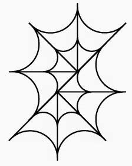

<h1 align="center">
    
    
        Arachne
    
</h1>

<h3 align="center">A fast context switching task scheduler using M:N user space fibers</h3>

 

    <a href="https://github.com/Kytha/Arachne/commits/master">
    
    <a href="https://github.com/Kytha/Arachne/blob/master/LICENSE">
    
    <a href="https://github.com/Kytha/Arachne/issues">
    
    <a href="https://github.com/Kytha/Arachne/pulls">
    

---

<h4 align="center">
  <a href="#About">About</a> •
  <a href="#Platform-Support">Platform Support</a> •
  <a href="#License">License</a> •
  <a href="https://github.com/Kytha/Arachne">Documentation</a>
</h4>

---

# About

A library used for aggressive parallelization of tasks that scales with hardware concurrency. Arachne utilizes user space fibers which are co-operatively scheduled across multiple worker threads. This approach to parallelism minimizes thread construction and context switching overhead, in addition to auto-scaling to high concurrency systems.
Arachne also precludes the need for task dependency graphs while still avoided nested induced deadlocks.

**Note:** Arachne is in very early development. Most features are not implemented yet.

## Benefits

- Extremely easy to taskify existing code
- Super-lightweight context switching
- Chaining tasks is very simple
- Seamlessly scales to maximize hardware threads
- Avoid nested induced deadlocks
- Minimize memory overhead of lifetime extension of resources
- Cache friendly fiber stacks

This approach is best suited for systems with many CPU bound units of work which must be chained or synchronous with other jobs. This library was built with the intent to be used with Game Engines but can also be applied in other applications. The benefits of using user space fibers are quite excellent and can yield significant performance increases when used in the correct context. A great example and inspiration for this library is Christian Gyrling's 2015 GDC talk on [Parallelizing the Naughty Dog engine using fibers](https://www.gdcvault.com/play/1022186/Parallelizing-the-Naughty-Dog-Engine)

However this architecture doesn't come without flaws. Some of the most apparent ones I could find are listed below.

# Cons

- I/O bound tasks can more easily starve
- Cannot provide quick high priority scheduling
- System synchronization primitives cannot be used inside task functions
- Currently debug support is not verbose

Therefore, it is not a great idea to use user space fibers if your tasks require realtime priority or are heavily I/O bound.

# Platform-Support

There is currently only intention for Arachne to support x86 64-bit architectures. Arachne is built to support Windows first. Linux and Mac support will follow.
